

10-second tour: Terrain → Wind → Physics → Optimize → Stream → Visualize

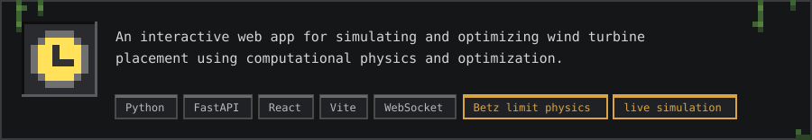


<h2></h2>

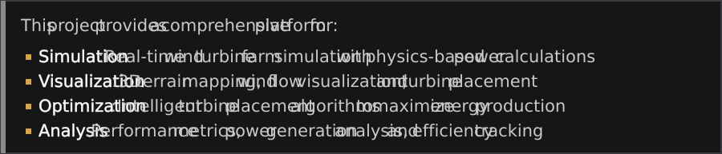

<h2></h2>

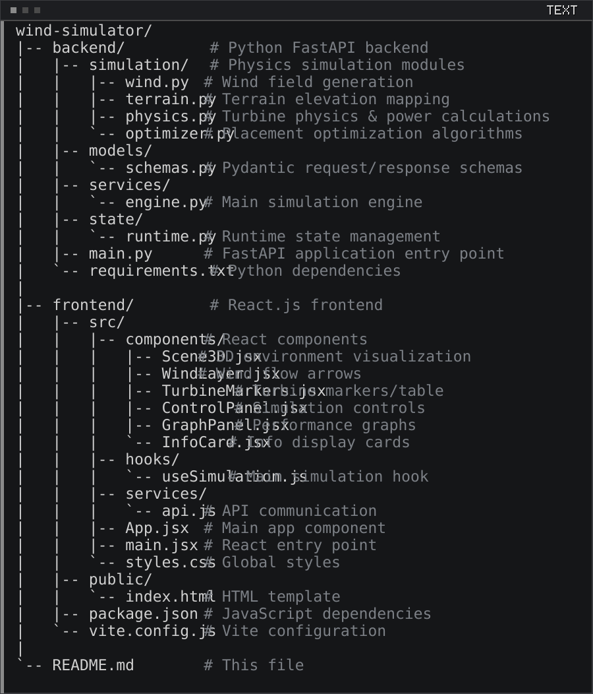

<h2></h2>

<h3></h3>

<h3></h3>

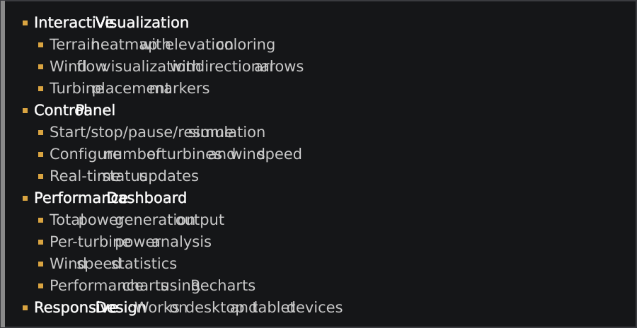

<h2></h2>

<h3></h3>

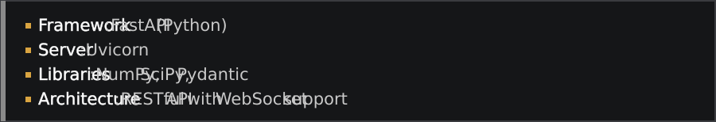

<h3></h3>

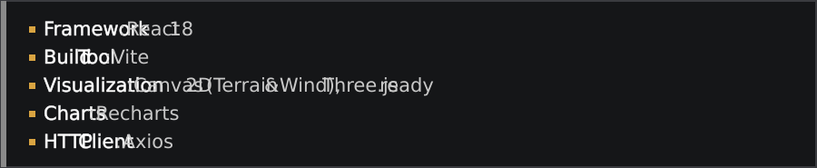

<h2></h2>

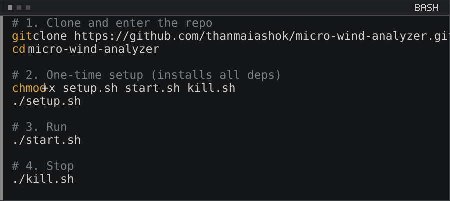

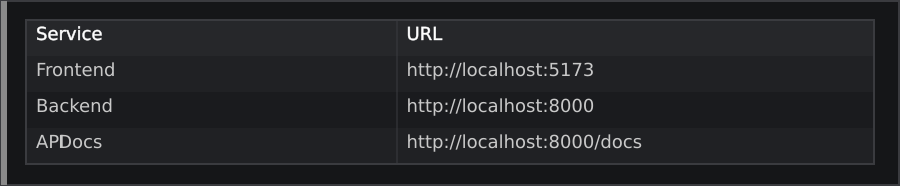

<h2></h2>

<h3></h3>

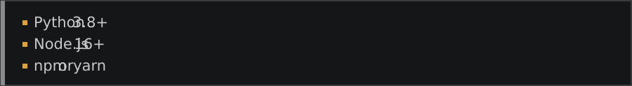

<h3></h3>

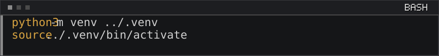

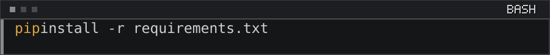

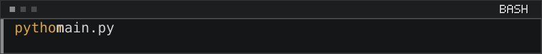

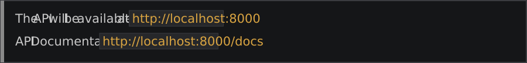

<h3></h3>

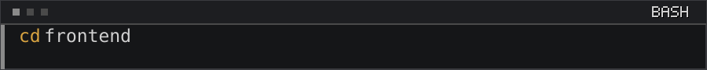

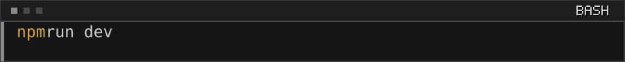

<h2></h2>

<h3></h3>

<h3></h3>

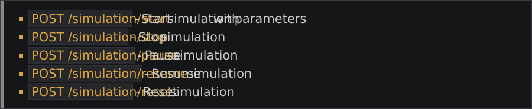

<h3></h3>

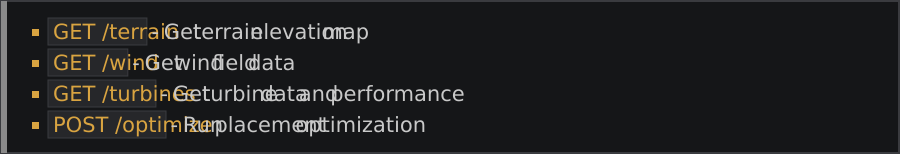

<h3></h3>

<h2></h2>

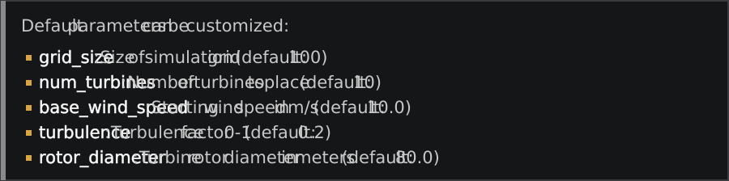

<h2></h2>

<h3></h3>

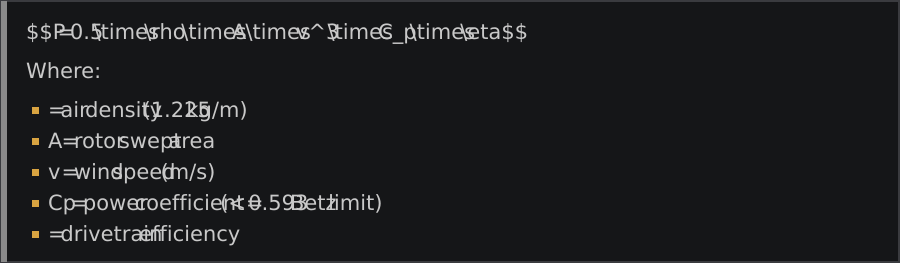

<h3></h3>

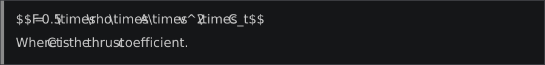

<h2></h2>

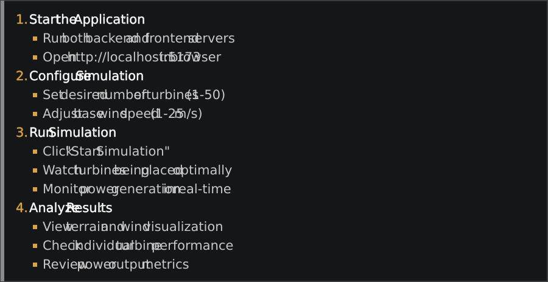

<h2></h2>

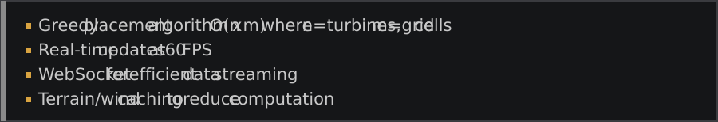

<h2></h2>

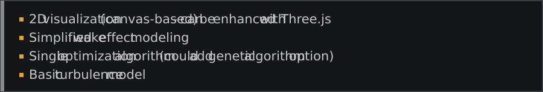

<h2></h2>

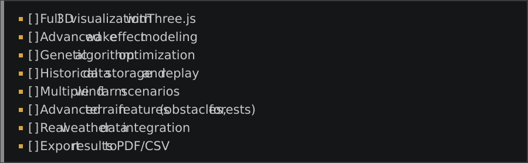

<h2></h2>

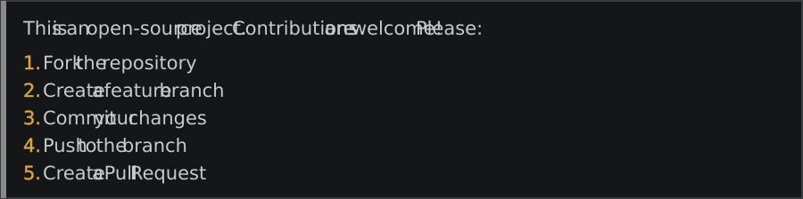

<h2></h2>

<h2></h2>

