# Wind Turbine Simulator

<p align="center"></p>
<p align="center"><sub>10-second tour: Terrain → Wind → Physics → Optimize → Stream → Visualize</sub></p>

An interactive web application for simulating and optimizing wind turbine placement using computational physics and machine learning optimization techniques.

## Overview

This project provides a comprehensive platform for:
- **Simulation**: Real-time wind turbine farm simulation with physics-based power calculations
- **Visualization**: 3D terrain mapping, wind flow visualization, and turbine placement
- **Optimization**: Intelligent turbine placement algorithms to maximize energy production
- **Analysis**: Performance metrics, power generation analysis, and efficiency tracking

## Project Structure

```
wind-simulator/
├── backend/                    # Python FastAPI backend
│   ├── simulation/             # Physics simulation modules
│   │   ├── wind.py            # Wind field generation
│   │   ├── terrain.py         # Terrain elevation mapping
│   │   ├── physics.py         # Turbine physics & power calculations
│   │   └── optimizer.py       # Placement optimization algorithms
│   ├── models/
│   │   └── schemas.py         # Pydantic request/response schemas
│   ├── services/
│   │   └── engine.py          # Main simulation engine
│   ├── state/
│   │   └── runtime.py         # Runtime state management
│   ├── main.py                # FastAPI application entry point
│   └── requirements.txt        # Python dependencies
│
├── frontend/                   # React.js frontend
│   ├── src/
│   │   ├── components/        # React components
│   │   │   ├── Scene3D.jsx   # 3D environment visualization
│   │   │   ├── WindLayer.jsx # Wind flow arrows
│   │   │   ├── TurbineMarkers.jsx  # Turbine markers/table
│   │   │   ├── ControlPanel.jsx    # Simulation controls
│   │   │   ├── GraphPanel.jsx      # Performance graphs
│   │   │   └── InfoCard.jsx       # Info display cards
│   │   ├── hooks/
│   │   │   └── useSimulation.js   # Main simulation hook
│   │   ├── services/
│   │   │   └── api.js         # API communication
│   │   ├── App.jsx            # Main app component
│   │   ├── main.jsx           # React entry point
│   │   └── styles.css         # Global styles
│   ├── public/
│   │   └── index.html         # HTML template
│   ├── package.json           # JavaScript dependencies
│   └── vite.config.js         # Vite configuration
│
└── README.md                  # This file
```

## Features

### Backend Features
- **Wind Generation**: Realistic wind speed and direction field generation with turbulence
- **Terrain Mapping**: Procedural terrain generation with elevation and slope calculations
- **Physics Engine**: 
  - Power output calculations using Betz limit theory
  - Thrust force calculations
  - Efficiency curves based on wind speed
  - Energy production over time
- **Optimization**: Greedy algorithm for optimal turbine placement
- **Real-time Simulation**: Continuous simulation with configurable speed
- **WebSocket Support**: Real-time data streaming to frontend

### Frontend Features
- **Interactive Visualization**: 
  - Terrain heatmap with elevation coloring
  - Wind flow visualization with directional arrows
  - Turbine placement markers
- **Control Panel**: 
  - Start/stop/pause/resume simulation
  - Configure number of turbines and wind speed
  - Real-time status updates
- **Performance Dashboard**:
  - Total power generation output
  - Per-turbine power analysis
  - Wind speed statistics
  - Performance charts using Recharts
- **Responsive Design**: Works on desktop and tablet devices

## Technology Stack

### Backend
- **Framework**: FastAPI (Python)
- **Server**: Uvicorn
- **Libraries**: NumPy, SciPy, Pydantic
- **Architecture**: RESTful API with WebSocket support

### Frontend
- **Framework**: React 18
- **Build Tool**: Vite
- **Visualization**: Canvas 2D (Terrain & Wind), Three.js ready
- **Charts**: Recharts
- **HTTP Client**: Axios

## Quick Start

**Prerequisites:** Python 3.8+, Node.js 16+

```bash
# 1. Clone and enter the repo
git clone <your-repo-url>
cd wind-simulator

# 2. One-time setup (installs all deps)
chmod +x setup.sh start.sh kill.sh
./setup.sh

# 3. Run
./start.sh

# 4. Stop
./kill.sh
```

| Service  | URL |
|----------|-----|
| Frontend | http://localhost:5173 |
| Backend  | http://localhost:8000 |
| API Docs | http://localhost:8000/docs |

---

## Getting Started (Manual)

### Prerequisites
- Python 3.8+
- Node.js 16+
- npm or yarn

### Backend Setup

1. Navigate to the backend directory:
```bash
cd backend
```

2. Create a Python virtual environment:
```bash
python3 -m venv ../.venv
source ../.venv/bin/activate
```

3. Install dependencies:
```bash
pip install -r requirements.txt
```

4. Run the server:
```bash
python main.py
```

The API will be available at `http://localhost:8000`

API Documentation: `http://localhost:8000/docs`

### Frontend Setup

1. Navigate to the frontend directory:
```bash
cd frontend
```

2. Install dependencies:
```bash
npm install
```

3. Run the development server:
```bash
npm run dev
```

The application will be available at `http://localhost:5173`

## API Endpoints

### Health & Status
- `GET /health` - Health check
- `GET /status` - Current simulation status

### Simulation Control
- `POST /simulation/start` - Start simulation with parameters
- `POST /simulation/stop` - Stop simulation
- `POST /simulation/pause` - Pause simulation
- `POST /simulation/resume` - Resume simulation
- `POST /simulation/reset` - Reset simulation

### Data Retrieval
- `GET /terrain` - Get terrain elevation map
- `GET /wind` - Get wind field data
- `GET /turbines` - Get turbine data and performance
- `POST /optimize` - Run placement optimization

### WebSocket
- `WS /ws/simulation` - Real-time simulation updates

## Simulation Parameters

Default parameters can be customized:
- **grid_size**: Size of simulation grid (default: 100)
- **num_turbines**: Number of turbines to place (default: 10)
- **base_wind_speed**: Starting wind speed in m/s (default: 10.0)
- **turbulence**: Turbulence factor 0-1 (default: 0.2)
- **rotor_diameter**: Turbine rotor diameter in meters (default: 80.0)

## Physics Model

The simulation uses the following physics models:

### Power Calculation
$$P = 0.5 \times \rho \times A \times v^3 \times C_p \times \eta$$

Where:
- ρ = air density (1.225 kg/m³)
- A = rotor swept area
- v = wind speed (m/s)
- Cp = power coefficient (≤ 0.593 Betz limit)
- η = drivetrain efficiency

### Thrust Force
$$F = 0.5 \times \rho \times A \times v^2 \times C_t$$

Where Ct is the thrust coefficient.

## Usage Example

1. **Start the Application**:
   - Run both backend and frontend servers
   - Open http://localhost:5173 in browser

2. **Configure Simulation**:
   - Set desired number of turbines (1-50)
   - Adjust base wind speed (1-25 m/s)

3. **Run Simulation**:
   - Click "Start Simulation"
   - Watch turbines being placed optimally
   - Monitor power generation in real-time

4. **Analyze Results**:
   - View terrain and wind visualization
   - Check individual turbine performance
   - Review power output metrics

## Performance Optimization

- Greedy placement algorithm: O(n × m) where n=turbines, m=grid cells
- Real-time updates at 60 FPS
- WebSocket for efficient data streaming
- Terrain/wind caching to reduce computation

## Known Limitations

- 2D visualization (canvas-based) - can be enhanced with Three.js
- Simplified wake effect modeling
- Single optimization algorithm (could add genetic algorithm option)
- Basic turbulence model

## Future Enhancements

- [ ] Full 3D visualization with Three.js
- [ ] Advanced wake effect modeling
- [ ] Genetic algorithm optimization
- [ ] Historical data storage and replay
- [ ] Multiple wind farm scenarios
- [ ] Advanced terrain features (obstacles, forests)
- [ ] Real weather data integration
- [ ] Export results to PDF/CSV

## Contributing

This is an open-source project. Contributions are welcome! Please:
1. Fork the repository
2. Create a feature branch
3. Commit your changes
4. Push to the branch
5. Create a Pull Request

## License

MIT License - Feel free to use this project for educational and commercial purposes.

## Contact

For questions or suggestions, please open an issue on the repository.

---

**Built with** 💚 **for renewable energy enthusiasts**
